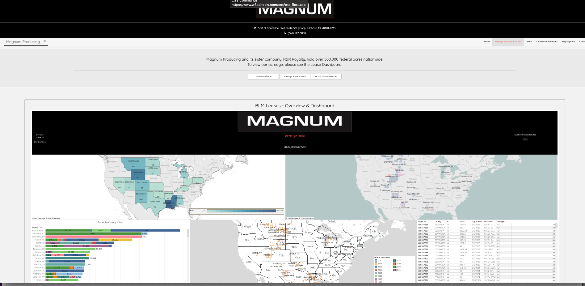
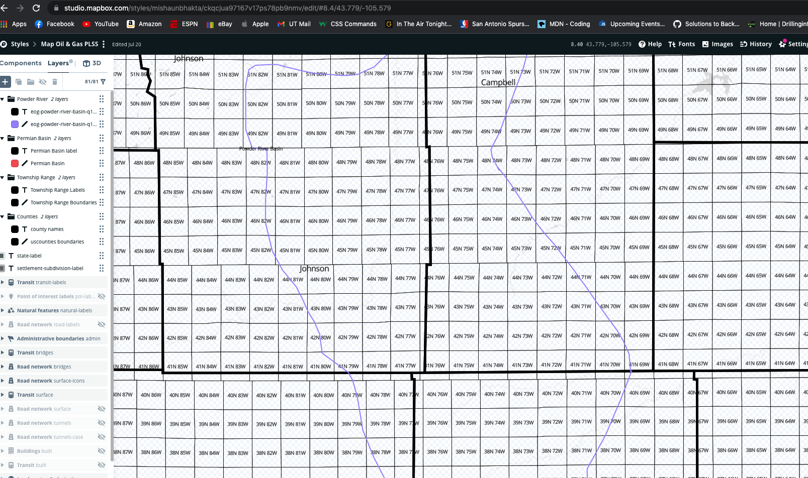
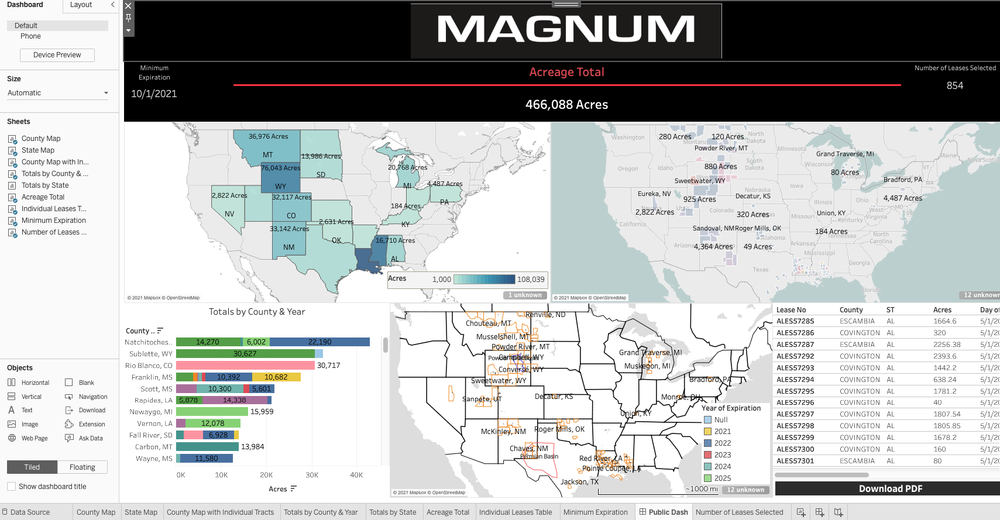
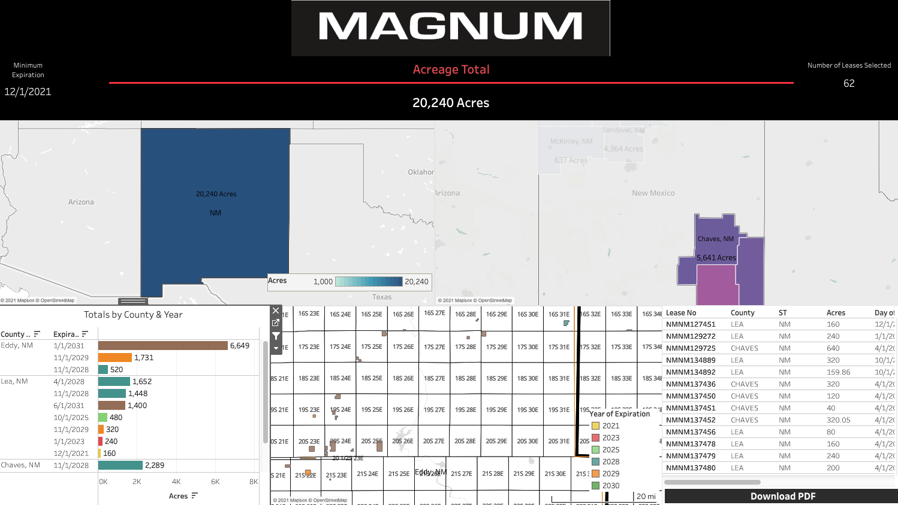
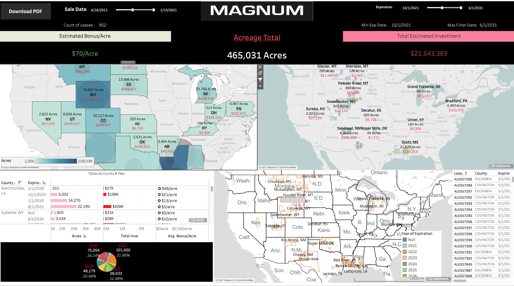

# Project Goals
1.  Clean and prep company lease records for geographic filtering and visualization in Tableau.  This will be done by adding official county names and FIPS codes to entered records.

2. Build Tableau Dashboard displaying key lease information for company CEO and public use such as acres by county, acres by expiration, etc.

3.  Host on company website built by me using Bootstrap's CSS library<br>
See here: http://magnumproducing.com/assets.html




<br>

# Libraries 
* Code: Python 3.6.10
* Packages:  Geopandas, Pandas, FuzzyWuzzy, Requests

<br>


# Data Sources & Script Details


## Data Sources:
1. US Counties Shapefile
    * Contains US County FIPS code and county boundaries
2. US State, FIPS, & Postal Code
    * *Webscraped*: Contains State name, state postal codes, and FIPS for joining with US Counties Shapefile
3.  Internal Company Lease Record (MySQL DB on AWS)
    * Database with tables holding all information on each company lease
4.  Internal Company Lease Shapefile 
    * Contains polygons of lease boudnaries for each company lease
5.  PLSS Shapefiles
    * Contains geographic subdivisions for US Counties (Township/Range)

### *Data Used in Preliminary Data Clean Script*
6.  LR2000 BLM Official Records
    * Batch download from official BLM database to cross check our leases with official records
7.  Drilling Info Lease Export
    * Recorded lease information hosted on Drilling Info web platform
    * Records will help match lease serial numbers to parcel numbers in internal data
        
<br>
<hr>
<br>

## Script Details

<br>

### 1.  Clean & Prep for Tableau - Database Lease Data, UScounties, Fuzzy Match, Load to DB
<hr>
<br>

**Goal**:  Partial or "Fuzzy" match county names from company lease records to official county names and FIPS code
<br>
<br>

#### Tasks
1.  Fetch data sources and join US Counties Shapefile with Webscraped State Table
2.  Create unique, compounded string with county and state postal code for "Fuzzy Matching" betweeen Internal Lease Records and Offical US County Names with FIPS codes
3.  Run Fuzzy Match Algorithms to join official county names and FIPS codes to Internal Lease Records
4.  Join Internal Company Lease Shapefile to Internal Lease Records holding Fuzzy Matched county names
5. Clean final joined datatable for exporting into ESRI Shapefile to be read into Tableau
6.  Load official county names and FIPS codes to company database

<br>

#### Code Snippets

Webscraping State Table and Joining to Counties Shapefile
```python
stlink = 'https://www.nrcs.usda.gov/wps/portal/nrcs/detail/?cid=nrcs143_013696'
stTable = pd.read_html(req.get(stlink).content)[0]

#last row had null fips due to extra read row from html source
stTable = stTable.iloc[:-1, :]
stTable["FIPS"] = stTable["FIPS"].astype(int)
stTable.rename(columns = {"FIPS": "State Fips"}, inplace = True)

usCounties = pd.merge(usCounties, stTable.iloc[:,1:], how="left", left_on = "STATE_FIPS", right_on = "State Fips")
```

Function for Fuzzy Matching
```python
def fuzzyMatchCustom(query, choices, User_score_cutoff = 0):
    '''
    This function will fuzzy matching to find matches for lease serial numbers in our master spreadsheet to BLM lR2000 
    database serial numbers or counties with official county names
    
    '''
    
    #assigingn an 88 score cutoff to avoid false matches
    match = process.extractOne(query, choices, score_cutoff=User_score_cutoff)
    if type(match) == type(None):
        return "No Match"
    else:
        return match[0]
```
Applying Function to Internal Lease Record Spreadsheet
```python
leases["Fuzzy Matched County"] = leases["County for Matching"].apply(lambda x: fuzzyMatchCustom(str(x), usCounties[usCounties['Postal Code'].isin(leases['ST'].unique())]['County Fuzzy Choices'], User_score_cutoff = 88))

```

<br>

### 2. Join GIS to DataBase Lease Records - Export Shape to Tableau
<hr>
<br>

**Goal**:  Join lease records from database to company GIS shapefile for exporting to Tableau. 
<br>
<br>

#### Tasks
1.  Connect to database and read lease records with official county names and FIPS codes
2.  Perform inner join to ensure all records in GIS shapefile match up to lease number in database
    * When there are differences, trouble shoot mismatches and fix source data by sending report to Data Entry team
3.  After data quality is ensured, perform left join on lease records in database to shapefile
    * left join is used to account for leases that may not have been plotted in GIS shapefile due to expiration, difficulty to plot, etc.

#### Code Snippets

1.  Reading in Data for Public Use from Database
```python
#pull in details table with official county names
sql = '''
SELECT d.*, o.official_county, o.fips FROM details d
INNER JOIN official_counties o
ON o.lease_no = d.lease_no;
'''

leases = pd.read_sql(sql, db)
```

2.  Reading in Data for Internal Use from Database

```python
investmentSql = '''
Select d.*, c.OFFICIAL_COUNTY, c.FIPS, i.YEARS_RENEWED, i.RENTALS_PAID, i.TOTAL_INVESTMENT, i.Estimated_Bonus from details d
join official_counties c
on c.lease_no = d.lease_no
join investment i
on i.lease_no = c.lease_no;
'''

internalLeases = pd.read_sql(investmentSql, db)
```


<br> 


### 3. Mapbox Prep - PLSS Merge
<hr>
<br>

 **Goal** : Create unified shapefile holding PLSS data to upload to Mapbox for connecting with Tableau.  PLSS data holds layers to break down counties in more detail (township/range).

<br>

#### Tasks
1. Combine all internal PLSS files with GeoPandas
2. Cleanup columns holding same type of information across varying column names
3. Create custom base map on Mapbox and connect with Tableau for optimal usability 



<br>
<br>

### PreClean - BLM Spreadsheet vs. GIS Shapefile
<hr>
<br>

**Goal**:  Optimiize the intenral process to ensure lease numbers are up to date and are correctly matching between the company lease database and GIS shapefile
<br>
<br>

#### Tasks
1.  Read in 4 data sources: 
    * Company Lease Internal Records
    * LR2000 BLM (Official Data)
    * DrillingInfo Leases
    * GIS Shapefile
2. Determine which lease numbers in internal spreadsheet differ from GIS spreadsheet
3. Use DrillingInfo to help match the differing lease numbers
4. Verify status comments based on LR2000 official records


<br>
<hr>
<br>

# Tableau Dashboard Images
### Dashboard Not Filtered


<hr>
<br>

### Dashboard Filtered to Select Counties


### Internal Version Teaser

